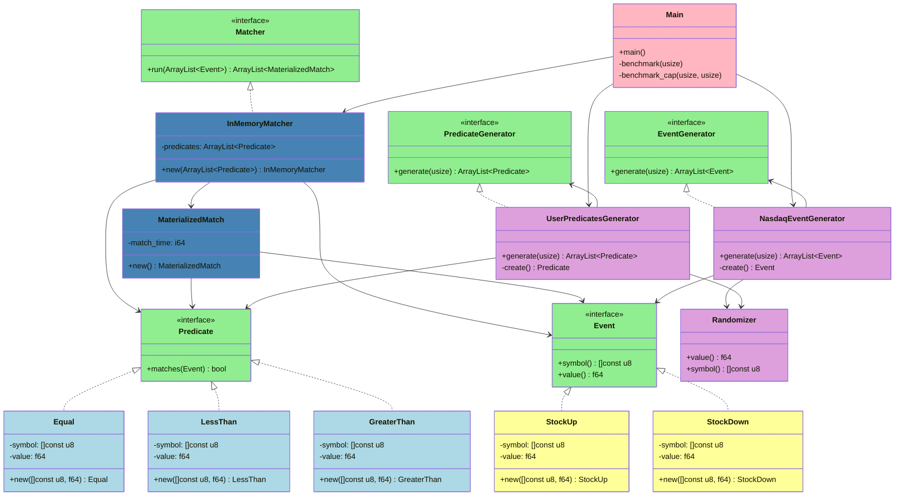

## Related POCS

- [1. Java Pure Memory - Stock Engine](https://github.com/diegopacheco/java-pocs/tree/master/pocs/stock-matcher-engine)
- [2. Java 25, Kafka, Kafka-Streams](https://github.com/diegopacheco/java-pocs/tree/master/pocs/java-25-kafka-streams-windoning-eo-purchases)
- [3. Java 25, Kafka, KsqlDB](https://github.com/diegopacheco/java-pocs/tree/master/pocs/java-25-kafka-ksqldb-windoning-eo-purchases)
- [4. Java 25, RocksDB](https://github.com/diegopacheco/java-pocs/tree/master/pocs/java-25-rocksdb-windoning-eo-purchases)
- [5. Java 25, Redis and Redis Streams](https://github.com/diegopacheco/java-pocs/tree/master/pocs/java-25-redis-windoning-eo-purchases)
- [6. Java 21, Kafka, Flink](https://github.com/diegopacheco/java-pocs/tree/master/pocs/java-21-kafka-flink-windoning-eo-purchases)
- [7. Java 21, Kafka, Spark](https://github.com/diegopacheco/java-pocs/tree/master/pocs/java-21-kafka-spark-windoning-eo-purchases)
- [8. Rust 2024, Pure Memory - Stock Engine](https://github.com/diegopacheco/rust-playground/tree/master/in-memory-stock-engine)
- [9. Zig 0.15.1, Pure Memory - Stock Engine](https://github.com/diegopacheco/zig-playground/tree/master/in-memory-stock-engine)

## Rationale

- Build an intentionally naive in-memory matcher in Zig to explore baseline costs for stock alerting.
- Keep a quadratic events x rules pass to measure worst-case latency before adding filtering or indexes.
- Use synthetic Nasdaq-like data to benchmark CPU and memory without external dependencies.
- Provide a reference point for future optimizations: rule caps, parallelism, better data structures or languages.
- Serve as a teaching toy for discussing complexity and scaling trade-offs in streaming/trading workloads.

### Build

```bash
zig build -Doptimize=ReleaseFast
```

### About it

Stock exchange application written in Zig.
Imagine you want to be notified when something happens, some GOOGLE(GOOG) stock went up or down.
There are some simple rules(Equal, GreaterThan,LessThan) when the stock price change. Fake Data generation techniques are used to generate a lot of data for benchmarks.
Such solution would be used for Day Trading applications.

### Design



Color scheme:
* Green (#90EE90): Traits (Interfaces)
* Blue (#ADD8E6): Predicates (rules)
* Purple (#DDA0DD): Fake data generation
* Dark blue (#4682B4): Matching engine
* Yellow (#FFFF99): Raw events
* Red (#FFB6C1): Main orchestration and benchmarks

### Benchmark

```bash
>> Benchmarks: CAP 100 rules
Matching 10 events / 100 predicates resulted in: [36] match in 0 ms
Matching 100 events / 100 predicates resulted in: [416] match in 0 ms
Matching 1000 events / 100 predicates resulted in: [4006] match in 0 ms
Matching 10000 events / 100 predicates resulted in: [33178] match in 7 ms
Matching 100000 events / 100 predicates resulted in: [340574] match in 45 ms
Matching 1000000 events / 100 predicates resulted in: [2992416] match in 286 ms
Matching 10000000 events / 100 predicates resulted in: [31254740] match in 2942 ms
>> Benchmarks: NO CAP (rules x events)
Matching 10 events / 10 predicates resulted in: [2] match in 0 ms
Matching 100 events / 100 predicates resulted in: [342] match in 0 ms
Matching 1000 events / 1000 predicates resulted in: [37243] match in 6 ms
Matching 10000 events / 10000 predicates resulted in: [3689967] match in 800 ms
Matching 100000 events / 100000 predicates resulted in: [373000881] match in 93526 ms
```

### How can we optimize and scale

1. Start filtering the rules by users(uuid, id, hash, or symbol, whatever).
2. CAP how many rules a user can have lets say 100 is max.
3. Use thread pool, process all in parallel rather a single thread, is all cpu bound (2 threads per core).
4. Simple things, integers instead of strings for symbols, it would speed up things and use less memory.
5. More machines with some seeding or light coordination(zookeeper like).
6. Instead of processing all at once, make continuous processing, as the events arrive you process.
7. Optimize the runtime with proper flags for allocation and pre-allocate memory
8. Further optimizations in Zig or other optimized languages like Rust or C.

### CAP 100 rules

Now we can do:
 * 100k in 45 ms
 * 1M in 286 ms
 * 10M in 2942 ms

Again, single machine, still have 7 other optimizations to play.